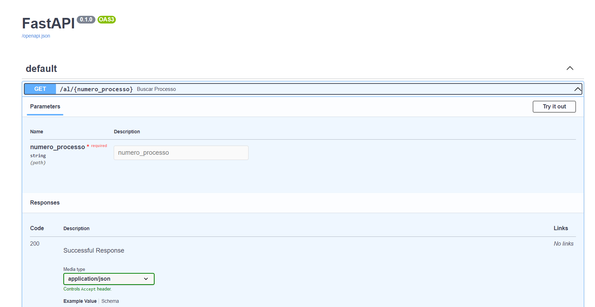
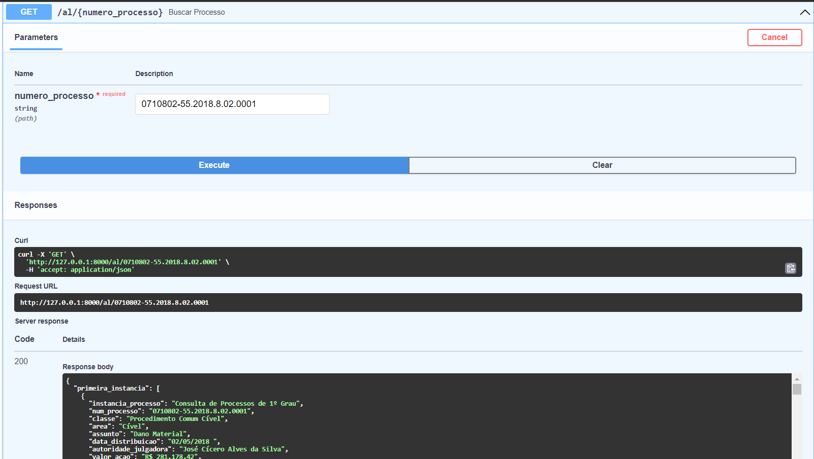

<h1 align="center"> O desafio </h1>

 O Jusbrasil coleta uma variedade de dados públicos que não são facilmente acessíveis e melhora seu acesso para todos. 
Um dos tipos de dados coletados são os dados sobre processos. 

 O desafio é <b>fazer uma API que busque dados de um processo em todos os graus dos Tribunais de Justiça de Alagoas (TJAL) e do Ceará (TJCE).</b> 

 Geralmente o processo começa no primeiro grau e pode subir para o segundo. Você deve buscar o processo em todos os graus e retornar suas informações.

 Será necessário desenvolver <b>crawlers</b> para coletar esses dados no tribunal e uma API para fazer <b> input e buscar o resultado depois.</b>

<h2> Input </h2>

 Você deve <b>criar uma api para receber um json contendo o número do processo</b>. Para descobrir o tribunal você pode pedir no input ou usar o [padrão cnj de numeração de processos jurídicos](https://www.cnj.jus.br/programas-e-acoes/numeracao-unica/) .

<h2> Output </h2>

 O cliente tem que ser capaz de pegar o dado quando o processamento termina, então você deve criar um mecanismo que permita isso, retornando sempre um JSON para os processos encontrados em todas as esferas.

<h2> Crawlers / Tribunais onde os dados serão coletados </h2>

 Tanto o TJAL como o TJCE tem uma interface web para a consulta de processos. O endereço para essas consultas são:

- TJAL 

    1º grau - https://www2.tjal.jus.br/cpopg/open.do

    2º grau - https://www2.tjal.jus.br/cposg5/open.do

 

- TJCE

    1º grau - https://esaj.tjce.jus.br/cpopg/open.do

    2º grau - https://esaj.tjce.jus.br/cposg5/open.do

<h3> Dados a serem coletados: </h3>

- classe
- área
- assunto
- data de distribuição
- juiz
- valor da ação
- partes do processo
- lista das movimentações (data e movimento)

<h3> Exemplos de processos: </h3>

- 0710802-55.2018.8.02.0001 - TJAL
para mais números de processo, busque no diário oficial de Alagoas: https://www.jusbrasil.com.br/diarios/DJAL/

- 0070337-91.2008.8.06.0001 - TJCE
para mais números de processo, busque no diário de justiça do estado do Ceará: https://www.jusbrasil.com.br/diarios/DJCE/

<h3> Alguns pontos que serão analisados:</h3>

- Organização do código
- Testes
- Facilidade ao rodar o projeto
- Escalabilidade: o quão fácil é escalar os crawlers.
- Performance: aqui avaliamos o tempo para crawlear todo o processo jurídico.

<h1 align="center"> Tutorial </h1>

 O projeto foi feito usando os seguintes pacotes:

~~~shell
Python 3.9.10
uvicorn 0.19.0
fastapi 0.85.2
requests 2.28.1
lxml 4.9.1
selenium 4.5.0
chrome 107.0.5304.88
chromedriver 107.0.5304.62
s.o Windows
~~~

 Para a chamada de processo de segunda instância, foi usado selenium, quando o projeto for executado abrirá uma
janela do chrome, mas não se preocupe quando o processo terminar ela será fechada automáticamente.

Obs. caso a versão do seu chrome for diferente... será preciso baixar uma versão do chromedriver compatível com seu
chrome, link para download do chromedriver abaixo:

[Download versões chromedriver](https://chromedriver.chromium.org/downloads)

<h2>Passo a passo:</h2>

  1. O primeiro passo será criar uma venv para o projeto, o nome da minha venv é venv, sinta-se a vontade para mudar o nome
     da sua <b>(para mudar o nome da venv mude o nome do último argumento do comando)</b>. No terminal da sua IDE
     digite o seguinte comando:

        ~~~shell
            python -m venv venv
        ~~~

  2. Depois da venv criada você precisa ativar ela para poder instalar os pacotes necessários, com o comando:

        ~~~shell
          .\venv\Scripts\activate
        ~~~
     O resultado será assim, quando ativada, terá o nome (venv) antes do caminho do projeto, dessa forma:

        ~~~shell
          (venv) PS caminho_projeto\desafioJusbrasil> 
        ~~~
  3. Agora com a venv ativada, você pode instalar os pacotes do arquivo requirements com o seguinte comando:

        ~~~shell
          pip install -r requirements.txt
        ~~~
  4. Agora com os pacotes necessarios instaldos, vamos rodar o projeto com o comando:

        ~~~shell
            uvicorn main:app --reload  
        ~~~
     
        
e terá o seguinte resultado:

        ~~~python
          <caminho do projeto>/desafioJusbrasil/main.py
          INFO:     Started server process [20828]
          INFO:     Waiting for application startup.
          INFO:     Application startup complete.
          INFO:     Uvicorn running on http://127.0.0.1:8000 (Press CTRL+C to quit)
      
        ~~~

  5. A main te retornará uma url com seu ip local, você precisará clicar no link.
    
Quando clicado no link abrirá uma guia do chrome com o seu ip local, será necessário colocar <b>/docs</b> 
       para acessar a api

    
Exemplo de url no chrome: 

        ~~~url
        http://127.0.0.1:8000/docs
        ~~~
  
        
 O resultado será assim: 

    
        

  6. Em seguida é só abrir qual estado você quer pesquisar o processo <b>al</b> ou <b>ce</b> 

    
Depois de clicar em uma dessas opções, vc precisa aperta no botão <b>Try in out</b> para poder testar a api

    
Depois de clicar em <b>Try in out</b>, você colocará o número do processo com essa formatação: <b>0710802-55.2018.8.02.0001</b> 
       , exemplo de <b>AL</b>, e em seguida clicar no botão <b>Execute</b> 

        
        
A tela ficará assim:

     
        
        
        
Depois de clicar no botão Try in out:

     
        
        
        
Resultado da pesquisa:

     
        

  8. Esse processo é o mesmo para <b>CE</b>
